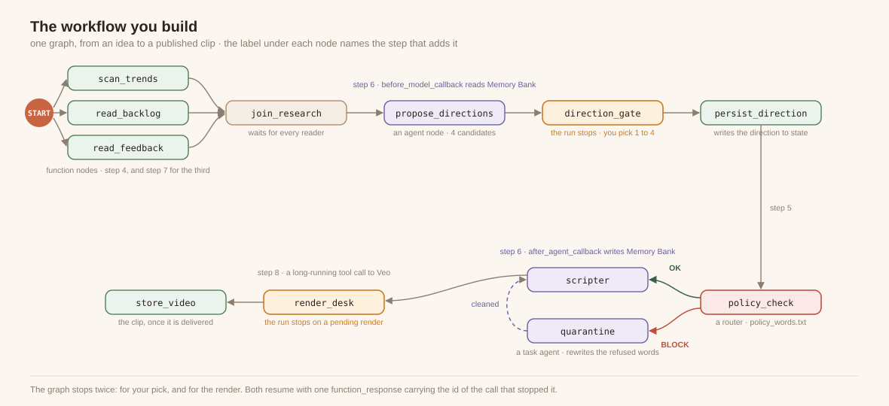
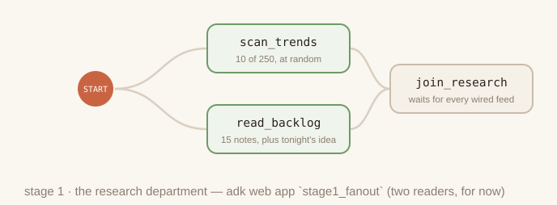
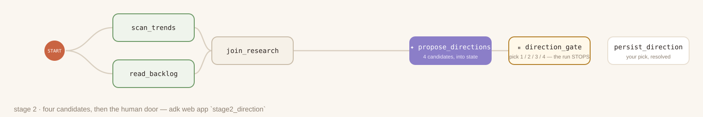

# Agentic workflow with ADK

## Introduction


This codelab guides you through building next-generation agentic systems using workflows and graphs in the Agent Development Kit (ADK). You will implement common architectural patterns, orchestrate human-in-the-loop (HITL) interactions, and handle long-running asynchronous execution. You will also integrate enterprise knowledge bases and persistent memory to customize and evolve agent behavior. Finally, you will connect these capabilities to drive an automated video generation pipeline.

### The scenario

You run a digital channel on VibeTube with an active audience and an expanding backlog of creative ideas. Producing each video requires continuous execution across multiple stages: researching trending formats, synthesizing viewer feedback, developing scripts, checking policy compliance, and generating video clips. Generative models can draft individual assets, but delivering consistent releases requires an orchestrated agent architecture.

To automate this lifecycle, you will build VibeStudio. This agentic pipeline executes routine research in parallel, presents curated options for human-in-the-loop sign-off, applies automated policy gates before generating video, and preserves context across production runs.



### What you learn

- **Graph engineering foundations**: Multi-step agent architectures require explicit control flow and structured execution paths. You build an ADK `Workflow` using edge tuples, the `START` entry point, `JoinNode` for parallel fan-out aggregation, and deterministic router nodes to steer execution based on state.
- **Agent modes and lifecycle callbacks**: Specialized tasks require distinct operational behaviors and deterministic guardrails. You configure ADK `Agent` instances using `chat`, `single_turn`, and tool-enabled `task` modes as workflow nodes, applying interceptors with `before_model_callback` and `after_agent_callback`.
- **Human-in-the-loop orchestration**: Production pipelines pause for human judgment at critical creative checkpoints. You implement `RequestInput` to suspend workflow execution, enforce structured response schemas, and resume execution without keeping idle runtime processes alive.
- **Hierarchical agent memory**: Production systems separate ephemeral execution state from durable context. You manage short-term session state using `Event(state=...)` and parameter binding, and connect GEAP Memory Bank to extract, consolidate, and persist creator preferences across runs.
- **Grounding with enterprise knowledge bases**: Autonomous agents require dynamic domain context and audience sentiment. You connect a GEAP RAG Engine corpus as a dedicated retrieval node within the parallel fan-out to semantically ground agent outputs.
- **Long-running workflows and deployment**: Multimodal video rendering operates asynchronously over extended durations. You implement `LongRunningFunctionTool` with pending call receipts to suspend and resume the workflow by call ID, and deploy the finished pipeline using the ADK `Runner` on Cloud Run.

### How this codelab is organized

This codelab serves as your conceptual and architectural reference. Each section explains the ADK constructs implemented in the corresponding workbench step, provides reference code, and establishes core design principles. Review each section before completing the corresponding exercise in the workbench.

Hands-on work takes place in the **VibeStudio Workbench**, a companion web interface featuring an interactive code editor, runtime verifiers, and an embedded ADK inspector. Step numbering in the workbench aligns directly with this codelab to keep your progress synchronized. Foundational graph edits persist across steps, with the workbench automatically verifying prerequisites as you advance.

Upon completing the workbench exercises, you will assemble an end-to-end agentic pipeline and deploy a running VibeStudio application to Cloud Run to generate video content.


The environment consists of three primary components: the **VibeStudio Workbench** (the local web interface for code editing and runtime verification), **your backend** (the ADK `Workflow` and stage sandboxes in `agent/`), and **Google Cloud** (Gemini models, GEAP Memory Bank, RAG Engine, and Veo video generation).

## Setup

### Claim your workshop credits

If you are attending an instructor-led lab, the instructor will distribute credits for your Google Cloud project. Follow the instructor's instructions to redeem your credits and ensure billing is active on your account before continuing.

### Open Cloud Shell

Cloud Shell is a browser-based development environment with `gcloud`, Python, and git preinstalled.

To launch Cloud Shell:

1. Navigate to the [Google Cloud console](https://console.cloud.google.com/).
2. In the top navigation header, click **Activate Cloud Shell** (the terminal window icon).

A terminal session opens at the bottom of the browser window.

### Clone and initialize the repository

Run the following commands in the Cloud Shell terminal to clone the project:

```console
git clone https://github.com/cuppibla/vibe-studio-lab
cd ~/vibe-studio-lab
```

#### Configuration prompts

During setup, you will be prompted for the following details:

- **Google Cloud project ID**: When prompted by `setup_project.sh`, press **Enter** to create a fresh project automatically. If you prefer to use an existing project (such as a pre-assigned project), enter your project ID and ensure the spelling is correct with billing active.
- **Event code**: Enter the room code provided by your instructor. If you did not receive one, check with a teaching assistant or a neighbor. If you are completing this lab at home, press **Enter** to accept the default `sandbox` room.
- **Channel display name**: Enter your name or preferred channel handle when prompted by `setup_codelab.sh`, or press **Enter** to accept the default generated from your Google account.

Run the two setup scripts in order:

```console
./setup_project.sh
./setup_codelab.sh
```

- `setup_project.sh`: Creates or reuses a Google Cloud project with active billing, saves the project ID to `~/project_id.txt`, and configures the active `gcloud` context.
- `setup_codelab.sh`: Installs `uv` and Python dependencies into `.venv`, enables required Google Cloud APIs, configures your channel settings in `.env`, verifies model access with Gemini, provisions Memory Bank and RAG resources, builds the workbench interface, and starts the VibeStudio Workbench.

The script runs the preflight check and starts the VibeStudio Workbench in the background. Its last lines display the link to open.

```
7 · Preflight
  ✓ python 3.12
  ✓ auth path A: Vertex via ADC (STUDIO_VERTEX=1)
  ✓ Google Cloud ADC (project <your-project>)
  ✓ stage0_prompt loads
  …
  ✓ stage6_video loads (13 edges)
  ✓ aiplatform.googleapis.com enabled (Gemini, Veo, Memory Bank, RAG Engine)
  ✓ vectorsearch.googleapis.com enabled (the vector store a RAG corpus is built on)
  ✓ Memory Bank connected
  ✓ RAG corpus connected
  ✓ VibeStudio Workbench running on port 4600

PREFLIGHT GREEN

Setup finished. The VibeStudio Workbench is already running.

  Open this and start at step 1
      https://4600-<your cloud shell host>/step/story

  It runs in the background. You do not need to start anything else.
      log      runs/lab.log
      stop     kill $(cat runs/lab.pid)
      start    scripts/start.sh
```

Click that link. The same address is available under **Web Preview → Change port → 4600**.

To re-check the environment at any point, run `python scripts/preflight.py`. To restart the workbench, run `scripts/restart.sh`. To set up again, run `./setup_codelab.sh`; it preserves your configuration and progress.

With it open, read **step 1, The story**, for the scenario, and **step 2, What you build**, for the shape of the finished graph. Neither has an exercise. Then return here for step 3.

Every hands-on part of the VibeStudio Workbench ends with a verification panel that reads the real artifacts: the file on disk and the sessions written by runs.

### Repository layout

The repository is structured into the core workflow logic, step-by-step sandboxes, the workbench environment, and the production application:

```
vibe-studio-lab/
├── agent/                  # Core ADK workflow, graph definition, and platform services
│   ├── graph.py            # Workflow graph definition, node functions, and routers
│   ├── desk.py             # Video render desk using LongRunningFunctionTool
│   ├── schemas.py          # Pydantic schemas for directions, gates, and scripts
│   ├── trends.py           # Trend generation and sampling utilities
│   ├── backlog.txt         # Creator video ideas backlog
│   ├── comments.md         # Audience comments for RAG Engine corpus seeding
│   ├── policy_words.txt    # Blocked subject words for deterministic policy checks
│   └── platform/           # Google Cloud service clients (Memory Bank, RAG, Veo)
│       ├── config.py       # Environment variables, locations, and model configurations
│       ├── memory.py       # GEAP Memory Bank callbacks and context injection
│       ├── rag.py          # GEAP RAG Engine corpus creation and semantic retrieval
│       └── videogen.py     # Veo video generation and operation polling
├── stage0_prompt/          # Step sandboxes: isolated agent.py files runnable in adk web
│   └── ...                 # stage1_fanout through stage6_video for incremental steps
├── server/ & web/          # VibeStudio Workbench (FastAPI backend and React frontend)
├── vibestudio/             # Complete production application deployed to Cloud Run
│   ├── server/             # FastAPI production server and event runner
│   ├── web/                # End-user React web application
```

- **`agent/`**: Contains the core workflow graph. You will edit files in this directory to implement parallel fan-out nodes, deterministic policy routing, memory callbacks, and video generation tools.
- **`agent/platform/`**: Interfaces with Google Cloud services, including Gemini models, GEAP Memory Bank, GEAP RAG Engine, and Veo video synthesis.
- **`stage0_prompt/` through `stage6_video/`**: Self-contained sandbox environments. Each folder exports a standalone `root_agent` so you can run and inspect each step in isolation via the embedded ADK development interface.
- **`server/` and `web/`**: The VibeStudio Workbench application running locally on port 4600. It hosts the step documentation, in-page code editor, runtime evidence verifiers, and graph visualization.
- **`vibestudio/`**: The complete production application packaged and deployed to Cloud Run in the final step. It contains its own standalone copy of the completed workflow graph.

## Monolithic agent

Before constructing a multi-node workflow graph, you establish an architectural baseline with a single agent in `stage0_prompt/agent.py`. This agent relies on a monolithic system prompt describing the production pipeline in prose, supported by two Python function tools.

Evaluating this baseline demonstrates the operational boundaries of prompt-driven coordination and establishes why production systems require graph orchestration.

### ADK agent architecture (3A)

In the **VibeStudio Workbench**, navigate to **Step 3 · Monolithic agent** and open **ADK agent architecture (3A)**. This view presents the core architectural layers of an ADK agent (`LlmAgent`):

```python
from google.adk.agents import LlmAgent
from google.adk.tools import mcp_toolset

root_agent = LlmAgent(
    model="gemini-3.5-flash",                 # model
    instruction=BRAND_INSTRUCTION,            # instruction
    skills=[load_skill("brand-audit")],       # skills
    tools=[mcp_toolset("mcp_brand_style")],   # tools
    output_schema=BrandStyleReport,           # structured output
    before_agent_callback=setup_ctx,          # interceptor
    before_model_callback=require_image,      # interceptor
    after_model_callback=schema_guard,        # interceptor
)
```

The interactive diagram groups agent components into five operational domains:

- **Reasoning layer (Model)**: The core language model (such as Gemini 3 Flash) executing cognitive tasks, prompt reasoning, and tool selection. Everything else in the architecture either informs or constrains this model.
- **Context layer (Instruction and Skills)**: Directives that shape model reasoning. `instruction` establishes the permanent system prompt, persona, and operational rules. `skills` provide versioned, procedural guidance (`SKILL.md`) for repeatable workflows.
- **Collaboration and action layer (Tools, Subagents, Workflow, Output Schema)**: Interfaces enabling the agent to act on external systems and emit typed data. `tools` provide callable Python functions or Model Context Protocol (MCP) endpoints. `subagents` execute subordinate delegated tasks. `workflow` coordinates multi-agent graphs. `output_schema` applies Pydantic models to guarantee downstream consumers receive validated JSON rather than unstructured text.
- **Interceptor layer (Lifecycle Callbacks)**: Deterministic guardrails executing custom code before and after agent execution (`before_agent`/`after_agent`), individual model turns (`before_model`/`after_model`), and tool calls (`before_tool`/`after_tool`). Interceptors enforce policy rules without relying on model compliance.
- **External state (Session and Memory)**: Stateful persistence separated from agent logic. `Session` preserves transient working memory and the event trace for the current execution thread. `Memory` maintains durable cross-session facts and preferences using managed services such as GEAP Memory Bank.

The monolithic agent in this step implements only three of these primitives: `model`, `instruction`, and `tools`. Subsequent steps introduce graph workflows, structured schemas, interceptors, and persistent memory services.

### Monolithic agent specification (3B)

In the workbench, advance to **Monolithic agent specification (3B)**. Open `stage0_prompt/agent.py` to examine the baseline agent definition:

- **Single prompt instruction**: The system prompt condenses five distinct production tasks into continuous prose: discovering platform trends, reviewing backlog ideas, proposing creative concepts, enforcing prohibited subject policies, and drafting shot lists.
- **Underlying data sources**: The agent references two sources defined beside the graph:
  - `agent/trends.py`: Samples ten active format and style trends from a pool of 250 with dynamic heat scores.
  - `agent/backlog.txt`: Reads the creator's raw concept notes line by line.

### Tools in Agent (3C)

In the workbench, advance to **Tools in Agent (3C)**. 

#### What is a tool to an agent?

A language model is inherently a closed-world reasoning engine: it operates solely on pre-trained weights and the tokens present in its immediate context window. It cannot natively query a database, access real-time APIs, or execute code.

A **Tool** bridges this boundary. It grants the model external agency, allowing it to retrieve ground-truth information and execute deterministic actions in external systems.

Tool calling follows an explicit five-stage protocol between the model and the ADK runtime:

1. **Schema declaration**: The developer provides Python functions to the agent. ADK inspects each function's name, type annotations, and docstrings to generate an OpenAPI-compatible JSON schema declaration describing its parameters and purpose.
2. **Model reasoning**: During inference, the model evaluates whether the user's prompt requires external data. If needed, the model emits a structured `function_call` event containing the target function name and argument dictionary matching the schema.
3. **Runtime execution**: The model itself does not execute code. The ADK runtime intercepts the `function_call`, executes the actual local Python function using the provided arguments, and captures the return value.
4. **Context re-injection**: The ADK runtime packages the function return value into a `function_response` event and appends it to the active session history.
5. **Final synthesis**: The model processes the tool output now present in its context window and completes its response.

In `stage0_prompt/agent.py`, the two research tools are defined as standard Python functions:

```python
def check_trends() -> dict:
    """Ten formats trending on the platform right now, with a heat score each."""
    from agent.trends import sample_trends
    return {"trends": sample_trends()}


def read_backlog() -> dict:
    """The creator's backlog: ideas they noted down to make someday."""
    from agent.graph import backlog_notes
    return {"backlog": backlog_notes()}
```

#### Hands-on edit and execution

In the workbench code editor, add the two function references to the agent's `tools` list:

<!-- code: TOOLS -->
```python
    tools=[check_trends, read_backlog],
```

Save your change. The file updates on disk, and the verification row confirms that both tools are wired.

Click **Open adk web** to launch the embedded ADK development interface. Send the suggested idea prompt:

```text
tonight's idea: a tiny robot doing laundry at midnight
```

#### What to expect and why

When you send this prompt, observe the following execution sequence in the session trace:

- **Two tool execution events appear before the response**: You see `function_call` and `function_response` events for `check_trends` and `read_backlog`.
  - **Why**: Gemini evaluated the system prompt directive ("check what is trending. look at your backlog of ideas"), recognized that it lacked platform trends and channel notes in its weights, and invoked both functions to ground its context.
- **The agent proposes a direction and pauses for confirmation**: The response suggests a video direction synthesizing the trends and backlog, and asks you to confirm.
  - **Why**: The instruction directive asked the model to agree on the direction with the creator before generating the script.
- **Bypassing confirmation in a follow-up turn**: Send a second message: `skip the questions, just describe the video`. The agent immediately bypasses confirmation and drafts the title and shots.
  - **Why**: Prompt instructions are advisory guidelines rather than deterministic barriers. In a monolithic agent, user instructions can override standing system prompt rules because no external workflow controls execution flow.

### Architectural limitations of a monolithic prompt

While a single prompt can produce acceptable output for isolated demos, testing boundary conditions in the workbench verifier reveals critical enterprise limitations:

- **Unstructured research aggregation**: Tool execution order is non-deterministic. The model summarizes retrieved data into free-form prose, making it impossible for downstream systems to isolate which source produced specific claims.
- **Unverified policy enforcement**: The model evaluates its own safety compliance. If the model determines a topic is safe, no external deterministic logic validates that finding.
- **Unenforced human-in-the-loop pauses**: Prompt instructions requesting creator confirmation are advisory. Sending a follow-up message instructing the model to bypass questions causes it to skip human approval entirely.

These architectural gaps motivate decomposing the monolithic agent into the explicit graph workflow built in the next step.

## Agentic workflow fundamentals

In the **VibeStudio Workbench**, navigate to **Step 4 · Agentic workflow fundamentals**, parts **4A** through **4D**.

This step transitions from a single-agent baseline to deterministic graph orchestration using ADK `Workflow`. You will build a parallel research fan-out, synchronize branches with a join node, generate schema-validated creative candidates, and introduce a deterministic human-in-the-loop approval gate.

### Graph architecture and execution chains (4A)

In the workbench, open **Graph architecture and execution chains (4A)**.

An ADK `Workflow` structures agent execution as a directed graph defined by an edge list:

- **Chains**: Sequential tuples define linear node execution (`(node_a, node_b, node_c)`).
- **Parallel branches**: Independent chains sharing an origin node execute concurrently.
- **Synchronization**: Chains converging on a `JoinNode` wait until all incoming branches report before releasing.
- **Deterministic control**: Execution flow is governed by declared code structures rather than inferred from prompt text.

#### Node archetypes in ADK

ADK workflows compose several specialized node types. Each archetype performs a specific operational role in the graph, separating deterministic code execution from generative model reasoning:

| Node Archetype | Implementation | Role in Pipeline |
|---|---|---|
| **Function node** | Python function returning an `Event` | Executes deterministic logic, data retrieval, and state mutations. |
| **Join node** | Built-in `JoinNode` instance | Synchronizes concurrent branches into an aggregated dictionary. |
| **Agent node** | `Agent` running in `single_turn` mode | Evaluates instructions against upstream input and emits validated data. |
| **Router node** | Function returning an `Event` with a `route` tag | Evaluates conditional logic to select downstream execution branches. |
| **Human input node** | Function yielding `RequestInput` | Suspends execution state until an external user response arrives. |

```python
root_agent = Workflow(
    name="stage1_fanout",
    description="2 real readers -> join -> one research dict",
    edges=[...])
```

In this configuration, `root_agent` is an instance of `Workflow` rather than a standalone `Agent`. ADK treats workflows as first-class agents, allowing an entire graph to be loaded, served, and inspected as a unified application. The `name` registers the application in ADK Web, while the `edges` list defines its execution topology.

### Parallel research fan-out (4B)

In the workbench, advance to **Parallel research fan-out (4B)**. Open `stage1_fanout/agent.py`.



#### Function nodes and synchronization barriers
The research phase uses two function nodes imported from `agent/graph.py`:
- `scan_trends`: Returns `Event(output={"trends": [...]})` containing ten scored platform trends.
- `read_backlog`: Returns `Event(output={"backlog": [...], "idea": "..."})` containing fifteen channel backlog ideas alongside the initial run prompt.

Each function accepts `node_input` (the previous node's output) and returns an `Event`. 

A `JoinNode` serves as a synchronization barrier: it pauses until every inbound chain delivers an event, then aggregates all branch results into a dictionary keyed by node name (`{"scan_trends": {...}, "read_backlog": {...}}`).

#### Hands-on edit: defining the join and parallel edges

In `stage1_fanout/agent.py`, instantiate the `JoinNode` and wire the two parallel chains starting from `START`:

<!-- code: FANOUT_JOIN -->
```python
join_research = JoinNode(name="join_research")
```

<!-- code: FANOUT_EDGES -->
```python
    edges=[(START, scan_trends, join_research),
           (START, read_backlog, join_research)])
```

Save your changes. The workbench verifier confirms that the join and edges are wired. Run the stage using **Run Stage 1** or through the embedded ADK Web interface.

#### What to expect and why
- **Concurrent reader execution**: In the execution graph, `scan_trends` and `read_backlog` execute simultaneously.
  - **Why**: Both chains originate at `START`. The ADK engine schedules independent branches concurrently.
- **Aggregated dictionary output**: The workflow completes at `join_research`, outputting a dictionary with entries for both readers.
  - **Why**: `JoinNode` ensures complete data capture before allowing subsequent nodes to execute.

### Agent nodes (4C)

In the workbench, advance to **Agent nodes (4C)**. Open `stage2_direction/agent.py`.



#### Operating modes and structured schemas
When embedded within a `Workflow`, an `Agent` runs in `single_turn` mode by default:
- It receives the previous node's output as its context input.
- It executes a single inference call without conversational back-and-forth.
- It outputs structured data to the next node.

By assigning `output_schema=Directions`, the agent enforces Pydantic validation on model output. The downstream graph receives typed objects rather than unstructured prose:

```python
class Direction(BaseModel):
    title: str           # <=60 chars, filmable, characterful
    angle: str           # the twist, one line
    hook: str = ""       # 2-4 words, the video's sticker line
    evidence: list[Evidence]


class Directions(BaseModel):
    candidates: list[Direction]   # exactly 4
```

`PROPOSE_INSTRUCTION` directs the model to propose four candidates citing evidence from both the trends and the backlog. Candidates 1 through 3 offer viable channel concepts. Candidate 4 intentionally introduces a policy-violating concept to test the safety gate in the next step.

#### Hands-on edit: defining the agent node and chaining the join

In `stage2_direction/agent.py`, configure `propose_directions` and extend the workflow edges:

<!-- code: PROPOSER -->
```python
propose_directions = Agent(
    name="propose_directions",
    model=config.MODEL,
    instruction=PROPOSE_INSTRUCTION,
    output_schema=Directions)
```

<!-- code: STAGE2_EDGES -->
```python
    edges=[(START, scan_trends, join_research),
           (START, read_backlog, join_research),
           (join_research, propose_directions, direction_gate)])
```

#### What to expect and why
- **Direct dictionary consumption**: `propose_directions` consumes the JSON payload emitted by `join_research` without manual formatting.
- **Typed candidate output**: The agent emits a validated `Directions` object containing four discrete candidates. Downstream nodes read fields by attribute name (`candidate.title`) without string parsing.

### Human-in-the-loop (4D)

In the workbench, advance to **Human-in-the-loop (4D)**. Open `agent/graph.py`.

#### Prompt instructions versus deterministic suspension
Production workflows that incur financial cost or publish content require human oversight at critical decision points. In a single prompt, confirmation requests are advisory instructions that a user can easily prompt the model to bypass. In an ADK workflow, human approval is enforced by the execution engine: the graph halts at a designated node and cannot advance until it receives external, schema-validated input:

- Yielding `RequestInput` suspends workflow execution immediately.
- ADK records an open interrupt call in the session store and issues a unique `interrupt_id`.
- The execution process halts without consuming tokens or server threads.
- Graph execution resumes only when a valid `function_response` matching the schema and interrupt ID is submitted.

#### Hands-on edit: suspending execution with RequestInput

In `agent/graph.py`, implement the suspension call inside `direction_gate`:

<!-- code: GATE_INPUT -->
```python
    yield RequestInput(
        message="Pick tonight's direction: 1, 2, 3 or 4.",
        response_schema={
            "type": "object",
            "properties": {
                "pick": {"type": "string", "enum": ["1", "2", "3", "4"]}}},
        payload={"candidates": cands})
```

`RequestInput` configures three attributes:
- `message`: The review prompt presented to the user.
- `response_schema`: A JSON schema that the frontend renders as an input form, validated by ADK upon submission.
- `payload`: Metadata bundled with the request (the four candidates), enabling client interfaces to render review cards without querying session state.

#### What to expect and why
- **The workflow halts at direction_gate**: In ADK Web or the workbench interface, the run pauses and displays an interactive candidate selection form.
  - **Why**: The engine encountered a yielded `RequestInput` and persisted execution state to `runs/sessions.db`.
- **Resumption requires structured input**: Sending arbitrary chat text does not advance the graph. Selecting an option (1, 2, 3, or 4) submits a typed `function_response` that satisfies `response_schema` and resumes execution.

## State and the policy gate
Duration: 0:11:00

In the **VibeStudio Workbench**, navigate to **Step 5 · State and the policy gate**, parts **(5A)** through **(5C)**.

This step completes the core production pipeline. You will persist user selections into session state, enforce channel safety policies using deterministic router nodes, and assemble an iterative task agent to automatically remediate policy violations before generating video scripts.

### State and parameter binding (5A)

In the workbench, navigate to **State (5A)**. Open `agent/graph.py` and `stage3_router/agent.py`.

#### Session state vs node output

In an ADK workflow, data moves across the graph through two distinct mechanisms:

- **Node output (`Event(output=...)`)**: Data directed strictly to immediate downstream consumers defined in the edge list.
- **Session state (`Event(state=...)`)**: A shared key-value dictionary accessible by any subsequent node in the execution lifecycle.

When a user selects a candidate at `direction_gate`, the selection arrives as a numeric index (`{"pick": "2"}`). Downstream nodes need the complete direction object: title, narrative angle, and hook line. Rather than passing verbose metadata through every intermediate node payload, `persist_direction` writes the resolved candidate to shared session state.

Each state mutation is emitted as a delta on an `Event`. ADK merges these deltas sequentially into the session store:

<!-- code: PERSIST_STATE -->
```python
    yield Event(state={"direction": chosen["title"], "angle": chosen.get("angle", ""),
                       "hook": hook, "user:prefs": {"last_direction": chosen["title"]}})
```

Yielding this `Event` hands control to the `Workflow` runtime, which appends the delta to the session journal in `runs/sessions.db`.

#### Parameter binding

ADK function nodes read session state automatically through parameter inspection. If a function signature declares a parameter name matching an existing state key, ADK extracts that key from state and passes it directly:

```python
def persist_direction(node_input, candidates: list = []):
    ni = node_input if isinstance(node_input, dict) else {}
    raw = ni.get("pick")
    pick = str(raw).strip() if raw is not None else ""
    if candidates:
        i = int(pick) - 1 if pick.isdigit() else 0
        chosen = candidates[max(0, min(len(candidates) - 1, i))]
    else:
        chosen = {"title": "untitled", "angle": "", "evidence": []}
    hook = chosen.get("hook") or " ".join(chosen["title"].split()[:4])
```

Here, `candidates` was written to session state by `direction_gate`. ADK binds it directly into `persist_direction(node_input, candidates: list = [])` without requiring explicit dictionary lookups.

Keys prefixed with `user:` persist across sessions in user-level storage, allowing subsequent workflow runs to access creator preferences.

#### Hands-on edit: persisting state and wiring the node

1. In `agent/graph.py`, inside `persist_direction`, replace the `TODO: PERSIST_STATE` line with the state event yield:

<!-- code: PERSIST_STATE -->
```python
    yield Event(state={"direction": chosen["title"], "angle": chosen.get("angle", ""),
                       "hook": hook, "user:prefs": {"last_direction": chosen["title"]}})
```

2. In `stage3_router/agent.py`, append `persist_direction` to the third chain in the `edges` list:

```python
           (join_research, propose_directions, direction_gate,
            persist_direction)
```

Save your files. In the workbench, verify that `state write in place` and `persist_direction in the chain` both show green checkmarks.

### The router node (5B)

In the workbench, navigate to **The router node (5B)**.


#### Deterministic policy routing

A router is a specialized function node that evaluates upstream output and directs execution along conditional graph branches. Unlike generative agents, a router executes deterministic logic without making LLM calls.

A router returns an `Event` specifying a `route` tag:

```python
def length_check(node_input):
    too_long = len(node_input.get("title", "")) > 60
    return Event(output=node_input, route="TRIM" if too_long else "PASS")
```

In the workflow definition, an edge target defined as a dictionary maps route names to destination nodes:

```python
    (length_check, {"TRIM": shorten, "PASS": scripter}),
```

The workflow router `policy_check` reads prohibited phrases from `agent/policy_words.txt` and performs whole-word matching against the chosen direction's title and angle:

<!-- code: POLICY_ROUTE -->
```python
    return Event(output=node_input, route="BLOCK" if bad else "OK")
```

Storing policy as data instead of hardcoded instructions enables updates without modifying the workflow graph: updating the text file immediately applies to subsequent runs. Because evaluation is deterministic regex matching, it executes in milliseconds at zero token cost before generative scripting begins.

#### Destinations: Scripter and Quarantine

The router directs traffic to one of two downstream nodes:

- **`scripter`**: A `single_turn` agent node that converts the approved direction into a structured production script adhering to the `Script` Pydantic schema:

```python
scripter = Agent(
    name="scripter",
    model=config.MODEL,
    instruction=SCRIPT_INSTRUCTION,
    output_schema=Script)
```

- **`quarantine`**: Initially a placeholder function that halts flagged directions, replaced in the next part by an autonomous remediation agent.

#### Hands-on edit: routing the policy check

1. In `agent/graph.py`, inside `policy_check`, complete the return statement:

<!-- code: POLICY_ROUTE -->
```python
    return Event(output=node_input, route="BLOCK" if bad else "OK")
```

2. In `stage3_router/agent.py`, update `edges` to route `policy_check` and rejoin the quarantine branch into `scripter`:

<!-- code: ROUTER_EDGES -->
```python
           (join_research, propose_directions, direction_gate,
            persist_direction, policy_check),
           (policy_check, {"OK": scripter, "BLOCK": quarantine}),
           (quarantine, scripter)])
```

Save your files. In the workbench, verify that the router edge mappings are verified.

### Agent modes and the task node (5C)

In the workbench, navigate to **Agent modes and the task node (5C)**.

#### Agent execution modes

ADK `Agent` instances support three execution modes tailored to specific pipeline requirements:

| Mode | Execution Lifecycle | Role in Pipeline |
|---|---|---|
| `chat` | Multi-turn conversational loop. The model determines when to invoke tools, solicit input, or end the turn. | Root agents facing an interactive human user. |
| `single_turn` | Single model inference call. Accepts previous node input and emits a structured schema object. | Sequential graph transformations (`propose_directions`, `scripter`). |
| `task` | Autonomous loop with tool execution. The agent iterates until calling the built-in `finish_task` tool. | Multi-step remediation and inspection (`quarantine`). |

#### Autonomous policy remediation

Rewriting a flagged direction requires `task` mode because the number of remediation iterations is variable. The agent receives the flagged direction, invokes `find_policy_hits` to detect violations, requests approved alternatives via `suggest_replacement`, rewrites the direction, and verifies cleanliness before proceeding.

Both tools are defined in `agent/cleanup_tools.py` with typed signatures and docstrings:

```python
def find_policy_hits(text: str) -> dict:
    """Which refused words appear in `text`. Matches whole words and phrases
    from agent/policy_words.txt, case-insensitive.

    Returns {"hits": [...], "clean": bool}. clean is true when hits is empty.
    """


def suggest_replacement(word: str) -> dict:
    """The channel's approved stand-in for a refused word, read from
    agent/policy_replacements.txt.

    Returns {"word", "replacement", "listed"}. When the word has no entry,
    listed is false and replacement is a hint to pick a gentle synonym.
    """
```

#### Hands-on edit: assembling the quarantine task agent

In `stage3_router/agent.py`, replace the placeholder `quarantine` function with the task agent definition:

<!-- code: QUARANTINE -->
```python
quarantine = Agent(
    name="quarantine",
    model=config.MODEL,
    instruction=QUARANTINE_INSTRUCTION,
    mode="task",
    tools=[find_policy_hits, suggest_replacement],
    output_schema=CleanedDirection,
)
```

Task mode equips the agent with tools and terminates execution by calling `finish_task`. When `mode="task"` is configured, ADK automatically provides `finish_task` and derives its parameters from `output_schema`, ensuring the node yields a typed `CleanedDirection` object matching the scripter node's input schema.

### Architectural comparison: monolithic prompt vs graph workflow

Each instruction from the original monolithic prompt now maps to a dedicated architectural construct:

| Original Monolithic Directive | Graph Implementation | Operational Benefit |
|---|---|---|
| "check trends, look at the backlog" | Parallel reader nodes and `join_research` | Both sources execute concurrently on every run. |
| "propose a direction and agree on it with the creator" | `propose_directions` and `direction_gate` | Four typed candidates persisted in state; approval is an explicit graph suspension. |
| "refuse blacklisted subjects" | `policy_check` router and `quarantine` task agent | Deterministic routing executed before generating script tokens; flagged directions are repaired automatically. |
| "describe the video" | `scripter` agent node | Generates structured script shots strictly after policy approval. |
| Implied execution sequence | Explicit `Workflow` edge list | Graph topology and execution order are strictly defined in code. |

#### What to expect and why

Test both execution paths in ADK Web or VibeStudio Workbench:

- **Approved route (Candidate 1, 2, or 3)**:
  - Selecting an approved candidate routes from `policy_check` directly to `scripter` (`route="OK"`).
  - The scripter generates a 3-shot production script adhering to the `Script` schema.
- **Quarantine remediation route (Candidate 4)**:
  - Candidate 4 contains flagged vocabulary ("clickbait", "viral hack").
  - `policy_check` routes to `quarantine` (`route="BLOCK"`).
  - In the session trace, observe `quarantine` calling `find_policy_hits`, calling `suggest_replacement` for each violation, rewriting the title, and calling `finish_task`.
  - Execution rejoins `scripter`, producing a script from the sanitized direction.

<aside class="positive">
<b>Routers and fallbacks.</b> The development UI flags a router with no fallback edge. If <code>policy_check</code> returned a route other than <code>OK</code> or <code>BLOCK</code>, the run would have no destination. Adding <code>DEFAULT_ROUTE: quarantine</code> to the edge dict covers that case; import <code>DEFAULT_ROUTE</code> from <code>google.adk.workflow</code>.
</aside>

## Memory: what the channel remembers about its creator
Duration: 0:10:00

Learning center: **step 6, Memory Bank**, parts **a** and **b**.

The agent has no memory of the creator yet. The more the creator uses it, the more it should remember about their preferences. This creator has a history: animals first, then gadgets, and lately fantasy. In this step that history lives in GEAP Agent Engine Memory Bank, and the graph reads it before it proposes. The graph does not change shape, because memory is a concern of two agents rather than a step in the pipeline.

### Memory Bank

Memory Bank is a managed service for long-term memory about a person. It holds facts about one user under a scope, and this codelab scopes it to the creator with an application name and a user ID.

```python
SCOPE = {"app_name": config.APP, "user_id": config.USER}
TOPICS = {
    "CREATOR_TASTE": "Which video directions this creator picks and passes on, "
                     "and how that preference changes over time.",
    "CHANNEL_RULES": "Standing instructions the creator states for every video "
                     "(style, subjects to avoid, format rules).",
}
```

Custom memory topics decide what a memory is allowed to be about. You define them once, when the bank is created, as a label and a description. At write time the service runs its extraction model once per topic, using the description as the instruction for what to look for, so the service decides which topic a fact belongs to. Text that matches no topic produces no memory.

A write is one `memories.generate` call carrying the scope and an exchange from the run. The service extracts the facts worth keeping, embeds them, and compares each one against the memories already in the scope. A close match updates that memory; no match creates a new one. The call returns what it did for each fact, which is how three sessions about cats become one memory about cats rather than three.

A read is one `memories.retrieve` call with the scope, which returns everything the bank holds for that person. The same embeddings support retrieval by query when you need a subset rather than the whole scope.

Both calls are in `agent/platform/memory.py`. The bank itself is an Agent Engine resource in your project, and its resource name is cached in `runs/memorybank.json`.

Memory Bank holds a person's preferences. Documents and transcripts belong in RAG Engine, which is the next step.

### Callbacks

A callback is a plain function passed as an argument to `Agent`. ADK calls it at a fixed point in the agent's turn, with the objects in play at that point, and reads its return value: `None` means continue as normal, and anything else replaces what would have happened next. There are six, arranged as a pair around the agent's turn, a pair around each model call, and a pair around each tool call.

| Pair | When | What it receives | Return value |
|---|---|---|---|
| `before_agent_callback` and `after_agent_callback` | Around the whole turn | A `CallbackContext`: state, the session, the invocation | `Content` replaces the agent's reply; `None` keeps it |
| `before_model_callback` and `after_model_callback` | Around each model call | The `LlmRequest` about to be sent, or the `LlmResponse` that came back | An `LlmResponse` skips or replaces the model's answer; `None` proceeds |
| `before_tool_callback` and `after_tool_callback` | Around each tool call | The tool, its arguments, and its result | A dict replaces the tool's result; `None` proceeds |

Callbacks are where guardrails, logging, caching, and context injection belong. This step uses two of them.

`recall_taste` runs as `before_model_callback` on `propose_directions`, immediately before its model call. It retrieves the creator's memories oldest first, appends them to the outgoing request with one instruction, to lean candidates 1 to 3 toward the most recent taste and treat the stated rules as constraints, and returns `None` so the call proceeds.

<!-- code: MEMORY_RECALL -->
```python
    output_schema=Directions,
    before_model_callback=recall_taste)
```

`remember_pick` runs as `after_agent_callback` on `scripter`, once its turn is over and the session state holds the direction that was chosen. It composes one sentence about tonight's pick and hands it to the bank.

<!-- code: MEMORY_REMEMBER -->
```python
    output_schema=Script,
    after_agent_callback=remember_pick)
```

The design rule this demonstrates: context that belongs to one agent rides a callback on that agent. Memory is not a node, because no other node in the graph needs it.

### In the learning center

Step **6a** explains the service and has three buttons that run the console commands: one creates the Agent Engine that hosts the bank, one seeds four past sessions covering the three eras of the creator's taste, and one lists what the bank holds. Compare the list with the four sessions in `agent/platform/bank.py`: the sessions were prose, and the memories are facts.

Step **6b** covers callbacks and has the two edits. Run the graph with an empty message so the proposal works from the backlog, the trends, and the memory alone, and read the model request in the development UI: it carries a memory block, and candidates 1 to 3 lean toward fantasy even when the trends suggest something else. After the run, list the bank again to see what tonight's pick changed.

## The audience's feedback in RAG Engine
Duration: 0:10:00

Learning center: **step 7, RAG Engine**, parts **a** and **b**.

The channel has viewers, and they leave comments. Thirty of them are collected in `agent/comments.md`: praise for a cat video and a sock-drawer dragon, a complaint that a gadget video felt like an advertisement, captions that covered the cat's face, an intro five seconds too long. In this step that file becomes a GEAP RAG Engine corpus, and the workflow asks it what viewers said about tonight's idea before it proposes.

### Retrieval over documents

RAG Engine is retrieval over documents. You upload files to a corpus. The service splits each file into passages, converts each passage into a vector with an embedding model, and stores the vectors. A question is embedded with the same model, and the passages whose vectors are nearest to it are returned. Vectors that sit near each other represent similar meaning, so a comment about a tiny dragon guarding one sock answers a question about small magic in the kitchen without sharing a word with it.

The corpus is created with its embedding model, and the file is uploaded with a chunking configuration that puts about 120 tokens in a passage, which is two or three comments.

```python
corpus = rag.create_corpus(
    display_name="vibestudio-feedback",
    description="Vibe Studio: what the audience wrote under the channel's past videos.",
    backend_config=rag.RagVectorDbConfig(
        rag_embedding_model_config=rag.RagEmbeddingModelConfig(
            vertex_prediction_endpoint=rag.VertexPredictionEndpoint(
                publisher_model="publishers/google/models/text-embedding-005"))))

rag.upload_file(
    corpus_name=corpus.name, path="agent/comments.md", display_name="comments.md",
    transformation_config=rag.TransformationConfig(
        chunking_config=rag.ChunkingConfig(chunk_size=120, chunk_overlap=20)))
```

A query is one `retrieval_query` call with the corpus and the text. It returns the nearest passages, each with a score that is the distance between the question's vector and the passage's, where lower is closer. `retrieve` in `agent/platform/rag.py` wraps the call and returns rows of text, score, and source. The corpus is a RAG Engine resource in your project, and its name is cached in `runs/ragcorpus.json`.

Chunk size is a design decision rather than a detail. Passages that are too small lose the context that makes them meaningful, and passages that are too large dilute the vector with unrelated content. Two or three comments per passage keeps each vector about one reaction.

### Retrieval as a node

Memory was context for one agent, so it rode a callback on that agent. Feedback is different: it is research, like the trends and the backlog, and it produces data the whole graph works from. That makes it a function node in the fan-out.

```python
def read_feedback(node_input):
    """The third reader (step 7): what the audience wrote under past videos,
    the passages nearest to tonight's idea. Retrieval, not a model call."""
    from .platform import rag
    idea = idea_text(node_input)
    query = idea or "what viewers liked and what they complained about"
    try:
        hits = rag.retrieve(query)
    except Exception as e:
        print(f"  [rag] feedback unavailable ({str(e)[:80]})")
        return Event(output={"query": query, "feedback": [],
                             "note": "no corpus connected - run: python -m agent.platform.rag"})
    return Event(output={"query": query, "feedback": [h["text"] for h in hits]})
```

The question is the idea that started the run, and with no idea it asks what viewers liked and complained about. Because `join_research` waits for every edge that enters it, adding the reader to the graph is one more edge, and the bundle the join produces gains a third key.

<!-- code: RAG_NODE -->
```python
           (START, read_backlog, join_research),
           (START, read_feedback, join_research),
```

The instruction of `propose_directions` already names that key: let the feedback steer candidates 1 to 3, lean into what viewers praised, avoid what they complained about, and cite the feedback in the evidence.

### In the learning center

Step **7a** explains the service and has three buttons: one creates the corpus, one uploads the comments and waits for indexing, and one queries the corpus with a question you type. Ask something that shares no word with the comment you expect and read what comes back.

Step **7b** covers the reader node and has the edit. After running it, compare two runs of the same idea: the retrieved passages are identical both times, and the candidates are not. Retrieval is deterministic, and the model that reads it is not.

## The video: a long-running tool
Duration: 0:10:00

Learning center: **step 8, The video**, parts **a** and **b**.

Generating a video with Veo takes a few minutes. Keeping the graph running for that whole time is a poor fit: the process occupies resources while doing nothing, and anything that goes wrong in the meantime takes the run down with it. This step makes the render asynchronous.

### Long-running work and a turn

An ordinary function tool completes inside the model's turn. The model calls it, ADK appends the result, and the model continues with that result in context. A render does not fit that shape, because the result does not exist for minutes.

`LongRunningFunctionTool` changes what ADK does with a pending result. The tool submits the work and returns a receipt immediately.

```python
def render_submit(prompt: str) -> dict:
    """Submit one Veo render of `prompt`. Returns at once with a pending
    receipt; the clip is delivered later, to this call, by id."""
    receipt = videogen.start(f"{prompt} {videogen.NO_TEXT}")
    return {"status": "pending", "operation": receipt["operation"], "prompt": receipt["prompt"]}
```

As a plain function tool, that dict would be a result like any other: the model would read it, answer in the same turn, and the graph would move on with nothing rendered. Wrapped as a long-running tool, a result whose `status` is `pending` marks the call id as long-running. The agent's turn ends there, the workflow suspends at that node, and the session holds the call, its id, and the receipt.

<!-- code: VIDEO_TOOL -->
```python
    tools=[LongRunningFunctionTool(render_submit)])
```

### Resuming by id

Resuming is one message: a `function_response` carrying the same call id and name, and the final result.

<!-- code: DELIVER_RESPONSE -->
```python
    part = Part(function_response=FunctionResponse(
        id=row["call_id"], name=row["name"], response=response))
```

That answer completes the `render_desk` node, and the graph continues to the next node. The agent does not take another turn, and completed nodes do not run again.

This is the same mechanism as the human pause. `RequestInput` suspends a run for a person and `LongRunningFunctionTool` suspends it for a receipt, and both are resumed by one `function_response` carrying the id of the call that suspended them. Whoever sends that message resumes the run: a web page, a console command, another process, or the same process after a restart.

Because nothing in the workflow polls, the polling belongs to a separate process. In this step that process is a console command, `python -m agent.deliver`, which reads the pending call out of the session store, polls Veo until the clip exists, and sends the response. In the deployment step, the application runs the same loop inside its own server.

### Veo

`agent/platform/videogen.py` talks to Veo. `start(prompt)` calls `generate_videos` and returns at once with the operation name. `check(operation)` calls `operations.get` and reports `{"done": False}` while the clip renders, then the file's path and URL once it exists. Every Veo call retries eight times, seventy seconds apart, configurable through `STUDIO_VIDEO_RETRIES` and `STUDIO_VIDEO_INTERVAL`.

With `STUDIO_REAL_VIDEO=0` in `.env`, `start` returns a stand-in receipt that `check` reports as done after five seconds with no file. The path through the graph is identical, at no cost.

### The node after the desk

`store_video` reads the delivered render from `runs/state.json`, where the delivery wrote it, and puts the URL and the status into shared state. It is the last node of the workflow.

<!-- code: VIDEO_EDGES -->
```python
           (quarantine, scripter),
           (scripter, render_desk, store_video)])
```

`runs/state.json` is the one place in this codelab where a file rather than session state carries a value, and the reason is that two processes are involved. The delivery process and the workflow do not share a session object, so the render is handed over through a file both can read.

### In the learning center

Step **8a** covers the long-running tool and has two edits: the wrapper on the tool, and the `FunctionResponse` in the delivery command. Step **8b** adds the last chain and runs the workflow until it suspends. Read the events in the development UI: a function call to `render_submit`, its response with `status: pending`, and no further events. The State tab has no render URL, and nothing is waiting for Veo.

The console panel on that page runs the delivery and streams its output. When it finishes, use the button beside it to reload the development UI on that session, because the development UI does not re-read a session that another process changed. The function response and `store_video` then follow the pending call, and the State tab holds the render URL.

## Deploy: the Runner, an application, Cloud Run
Duration: 0:10:00

Learning center: **step 9, Deploy**.

Every step so far ran the graph through the ADK development UI. The application in `vibestudio/` runs it through the same class the development UI uses, a `Runner`, with its own page in front and one event stream between them.

### The Runner

A `Runner` takes an application name, the agent or workflow, and a session service. `run_async(user_id, session_id, new_message)` yields every event the graph produces and stores them in the session.

```python
self._svc = DatabaseSessionService(db_url=config.DB_URL)
self._runner = Runner(app_name=config.APP, agent=wf, session_service=self._svc)

async for ev in self._runner.run_async(user_id=config.USER, session_id=run_id, new_message=message):
    self._absorb(ev)    # fold the ADK event into the run state, publish one app event

# the gate's answer and the render's delivery are the same call, with a function_response part
part = Part(function_response=FunctionResponse(id=call_id, name=name, response=response))
```

The gate's answer and the render's delivery reach the graph through the same call, which is the mechanism you used by hand in the earlier steps.

### The application

The sandbox applications of the earlier steps each wired a subset of the graph. This application skips them and runs `wf` from `agent/graph.py`, the complete workflow, so the files you edited are the files it executes. The delivery console is not needed here, because the server polls Veo and answers the pending call itself.

```
vibestudio/
  server/
    main.py                 FastAPI: the page, /api, /static
    api.py                  the REST surface: run, pick, publish, backlog, profile, history
    runner.py               the Runner over the finished workflow, the render poller
    platform/               bus (the SSE stream), files, publish, avatar, telemetry, graphinfo
    agent/                  the finished agent, byte-equal to the lab's agent/ (checks/verify_app.py)
      graph.py              the workflow: direction_gate (4d), persist_direction (5a), policy_check (5b),
                            quarantine and the edge list (5c), read_feedback (7b), store_video (8b)
      desk.py               render_desk and render_submit, the LongRunningFunctionTool (8a)
      schemas.py            Directions, CleanedDirection, Script (4c, 5b, 5c)
      cleanup_tools.py      find_policy_hits, suggest_replacement (5c)
      trends.py · backlog.txt · comments.md · policy_words.txt · policy_replacements.txt
      platform/
        memory.py           recall_taste, remember_pick, Memory Bank (6)
        rag.py              retrieve, RAG Engine (7)
        videogen.py         start, check, Veo (8)
        state.py · config.py
  web/                      the React page
  Dockerfile · deploy.py · run.sh
```

The server owns the Runner, the render poller, the publisher, and the files. The page draws the graph from `GET /api/graph`, which reads `wf.graph`, so a change to the workflow changes the picture. Every change is one event on a single stream, and each event carries the run state after it, so a page that connects late is current from its first message.

The last design rule is visible here: the application owns the loop, not the graph. A `Runner` drives the workflow, an event stream reports it, and the graph itself does not know that a page exists.

The workflow the application drives is the edge list you built, with the third reader and the render desk in place.

<!-- code: EDGES -->
```python
        (START, scan_trends, join_research),
        (START, read_backlog, join_research),
        (START, read_feedback, join_research),
        (join_research, propose_directions, direction_gate,
         persist_direction, policy_check),
        (policy_check, {"OK": scripter, "BLOCK": quarantine}),
        (quarantine, scripter),
        (scripter, render_desk, store_video),
```

### Cloud Run

Cloud Run is a serverless service for hosting your application and your agents. It scales instances up and down with traffic, and bills per request time. `gcloud run deploy --source` builds the container from the Dockerfile in the folder as part of the deployment, so shipping the application is one command.

```console
gcloud run deploy vibestudio --source vibestudio \
  --project $GOOGLE_CLOUD_PROJECT --region us-central1 \
  --labels dev-tutorial-codelab=vibetube --allow-unauthenticated \
  --memory 2Gi --cpu 2 --timeout 3600 --concurrency 40 \
  --max-instances 1 --min-instances 1 --session-affinity \
  --set-env-vars GOOGLE_CLOUD_PROJECT=…,STUDIO_VERTEX=1,STUDIO_MEMORY_BANK=…,STUDIO_RAG_CORPUS=…,VIBETUBE_URL=…,VIBETUBE_EVENT=…,VIBETUBE_NAME=…,VIBETUBE_PROJECT=…
```

This application keeps a run's state in its process, so the deployment asks for one instance kept warm and for session affinity. A production version would keep that state in the session store and let instances come and go freely. The label makes the service easy to find and clean up afterwards.

The application also exports ADK's traces to Cloud Trace in the same project, giving one trace per run with a span for each node, each model call, and each tool call. Open Trace Explorer in the Cloud console and filter on the service name `vibestudio`. Setting `STUDIO_TRACING=0` turns the export off.

### In the learning center

Step **9** explains the architecture, shows the Runner code and the folder layout, and has the Deploy button, which runs the command above with the values filled in from `.env` and the two cached resource names, and streams the output. The last line is the service URL.

## Summary
Duration: 0:03:00

Learning center: **step 10, Summary**, which draws the finished graph and links each node back to the step that built it.

| Step | Concepts |
|---|---|
| A single prompt | An `Agent` with function tools; `function_call` and `function_response` events; the limits of prose as an interface between steps |
| The research fan-out | `Workflow`, `START`, edges as tuples, `JoinNode`; an `Agent` as a node with `output_schema`; `RequestInput` with a response schema and a payload |
| State and the policy gate | `Event(state=...)`, parameter binding, the `user:` prefix; a router node; policy as data; agent modes and a task agent with tools |
| Memory Bank | Scope, extraction, embedding, consolidation, custom topics; `memories.generate` and `memories.retrieve`; `before_model_callback` and `after_agent_callback` |
| RAG Engine | A corpus, chunking, an embedding model, retrieval by meaning; a retrieval node as one more edge into the join |
| The video | `LongRunningFunctionTool`, the pending receipt, a workflow suspended at an agent node, resume by id from another process |
| Deploy | The `Runner` and `run_async`; an application on top with one event stream; a container on Cloud Run |

The design rules from the introduction, as the finished graph applies them.

- A graph pauses for a person or for a receipt, never for a wait. `RequestInput` and the pending tool call both suspend the run, and nothing stays alive on its behalf.
- Every resume is one `function_response` carrying the call's id, whoever sends it: a page, a console, another process, or the same process after a restart.
- Nodes share state by key name. The candidates, the direction, and the render URL move through the graph without being passed between nodes.
- Routing is plain code and policy is data, decided before any money is spent.
- Context that belongs to one agent rides a callback on that agent, and research that produces data for the graph is a node in the fan-out.

### Next steps

- Replace `DatabaseSessionService` with `VertexAiSessionService`, so the application's sessions live beside the Memory Bank and instances can come and go.
- Deliver the render by webhook instead of by polling: the same `function_response`, sent by whoever hears from Veo first.
- Add a second person to the graph, with a reviewer's `RequestInput` before publishing.
- Append new audience comments to the corpus after each publish, and watch the next run lean toward them.
